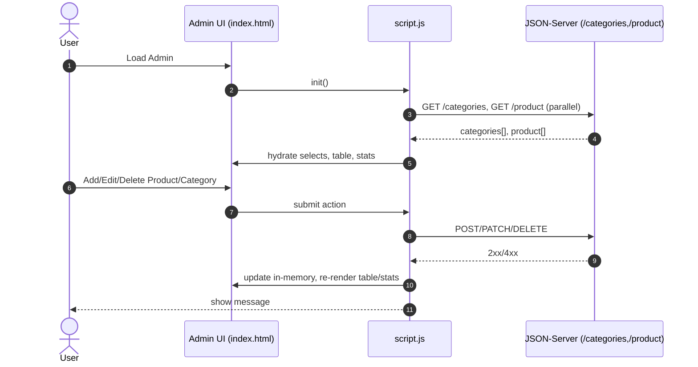
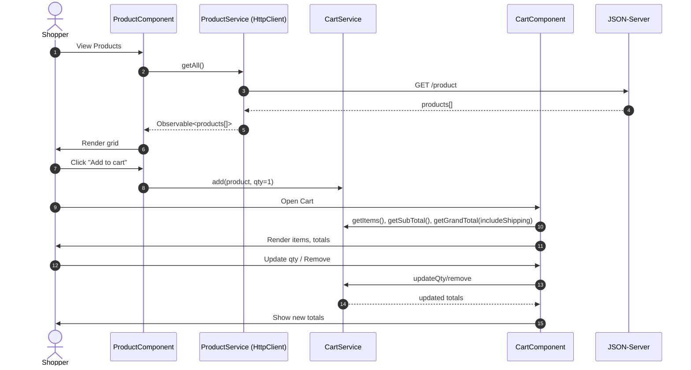

# 🍞 Bakery Project

This is the **README** for our ITI Summer Training graduation project.
We successfully completed the project, which was a hands-on application of everything we learned.

## 🛠️ Tech Stack

* **HTML, CSS, JavaScript**
* **ES.Next** (validation + modern features)
* **Bootstrap** (for responsive design)
* **Angular** (routing, components, data binding)
* **JSON Server** (mock backend API)

## 📌 Features

* **Dashboard**

  * Add/manage items (cakes, bread, cookies, etc.)
* **Team Page**

  * Show team members (names, photos, social accounts for contact)
* **Routing**

  * Smooth navigation between pages
  * Connected with **JSON Server** for CRUD operations

## 🏠 Pages

* **Home**
* **About**
* **Products** (core functionality: search, add, filter)
* **Contact**
* **Cart** (manage added products + checkout)

---

## Sequence Diagram(s)

---

## 🎯 Goal

The project simulates an **online bakery store**, where users can browse products, add them to the cart, and manage their shopping process.

## 🤝 Team

Special thanks to my amazing team for the effort and collaboration we put in to deliver the project in the best way possible.
**We’re proud of what we achieved 🙌**
